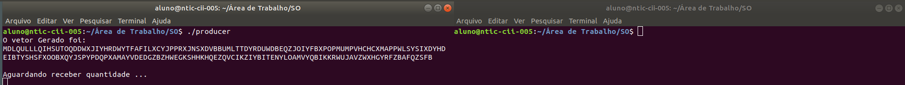
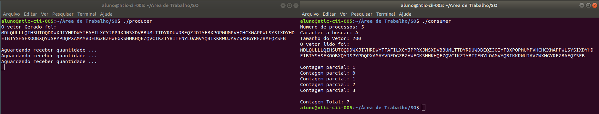
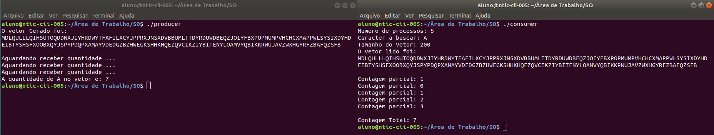

# Comunicar dois processos através da memória compartilhada

## Enunciado

Implemente uma solução para o seguinte problema: contar o número de ocorrências de um caracter em vetor contendo 10000 caracteres. 

O vetor deve ser gerado por um processo P1. Outros N processos, não filhos de P1, deverão contar as ocorrências do caracter em uma parte do vetor. Por exemplo, considerando um vetor de 10000 elementos e 4 processos, cada processo realizará a contagem em um subconjunto de 2500 elementos do vetor.

O processo P1 deverá: i) alocar o vetor na memória compartilhada; ii) informar o valor de N desejado (ou seja, quantos processos realizarão a contagem); e iii) informar o caracter que será contado. Após o termino da contagem realizada pelos N processos, o processo P1 deverá exibir o resultado total da contagem.

## Lógica adotada

Foram feitos dois códigos, um chamado *consumer* e outro chamado *producer*. O *producer* é o responsável por gerar o vetor e passar as informações para a memória compartilhada, enquanto o *consumer* é o responsável por acessar a memoria compartilhada, e fazer a devida contagem dos caracteres.

Foram utilizadas duas alocações de memória compartilhada, uma chamada *vetor* e outra chamada *info*, na qual uma serve apenas para armazenar o vetor gerado e a outra para salvar dados informativos (tamanho do vetor, numero de processos que deverão contar, tamanho do vetor, quantidade contada), respectivamente.

## Execução

No início do *producer* é definido as variáveis da *info*, que podem ser alteradas a vontade, com exessão da *quantidade contada*, que obrigatoriamente é definida inicialmente como *-1* (o motivo disso será explicado posteriormente).

Após definição dos parâmetros que o vetor terá, o mesmo é gerado e salvo na memória compartilhada *vetor*. Após isso ele aloca/acessa a memória compartilhada *info* e salva os dados informativos lá, seguindo uma devida ordem, pré-estabelecida em ambos os códigos.

Diante disso, temos todos os dados necessários na memória compartilhada, então, o *producer* entra em um loop, analisando o ponteiro que representa a informação *quantidade contada*. Enquanto o valor permanecer igual a -1, ele ficará preso nesse loop, informando apenas uma mensagem a cada 10 segundos, conforme imagem abaixo: (Nas demonstrações, foi utilizado um vetor de apenas 200 caracteres e 5 processos para contar, para facilitar na visualização, mas basta alterar as variáveis para que o vetor gerado e o numero de processos seja maior).

Agora, precisamos rodar o *consumer*, para ele contar e retornar o valor contado para o *producer*. A comunicação entre os *conducer* e os processos gerados dentro dele é feito pelo próprio retorno, para abranger o máximo da matéria passada em aula. Ao rodar o *consumer* temos a seguinte saida:

Nesse ponto, o *consumer* já foi executado, e o retorno dos processos filhos foram impressos na tela, somados, e salvo na memória compartilhada *info*, no endereço correspondente à *quantidade contada*. Diante dessa mudança, o *producer*, ainda em execução, percebe a alteração do valor da *quantidade contada* e continua o fluxo, que é apenas a impressão do valor encontrado nesse endereço de memória, conforme pode ser visto na imagem abaixo:

