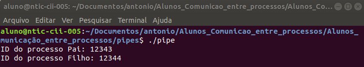
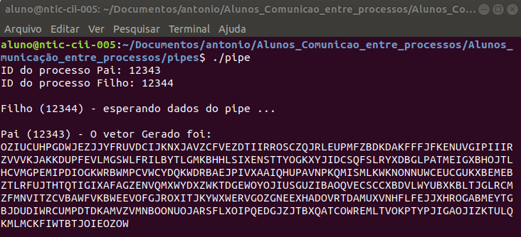
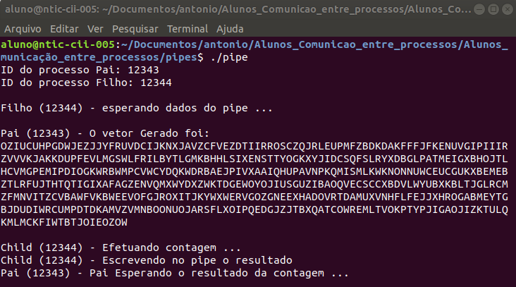
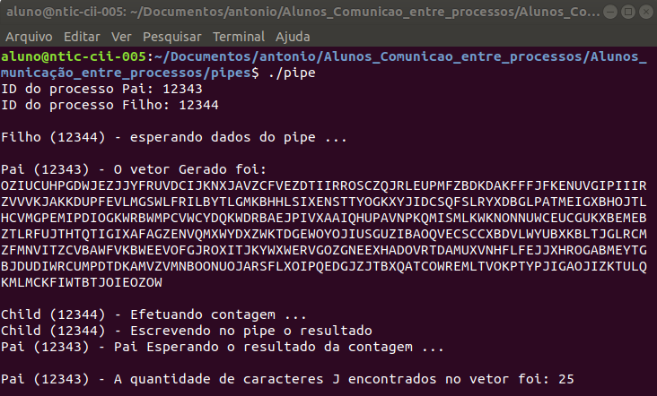
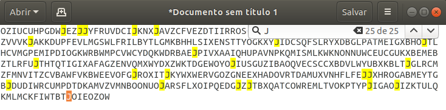

# Comunicar dois processos através de Pipe

## Enunciado

Utilizando pipe, suponha 2 processos P1 e P2:

* P1 possui um vetor V de caracteres
* P1 gera um processo P2 (por meio do fork)
* P1 preenche o vetor V (o preenchimento do vetor deve ser feito apenas no P1 e depois da criação de P2)
* P1 envia o V para P2 por meio do pipe
* P2 conta o número de ocorrências de um determinado caracter em V
* P2 envia para P1, via pipe, o número de ocorrências do caracter.
* P1 exibie o número de ocorrências

## Lógica adotada

Nesse projeto temos apenas um arquivo, chamado *pip.c*. Nesse arquivo, gera-se dois processos, na qual o pai corresponde ao *P1*, e o filho corresponde ao *P2*.

## Execução

Compile e execute o *pipe*. Após isso, teremos a impressão na tela dos ID's correspondentes ao processo pai e ao processo filho. Esse ID será utilizado em todas as mensagens impressas, para diferenciar quem está enviando.

Após isso, enquanto o Filho está esperando, o Pai gera o vetor.

Depois de gerado, o Pai insere o Vetor com suas devidas informações no *Pipe*. Diante disso, o Filho recebe a informação e começa a fazer a devida contagem dos caracteres, para posteriormente inserir a resposta da contagem no *Pipe*.

Após todos esses passos, o Filho insere o resultado no *Pipe*, e o Pai (que estava esperando), imprime o resultado na tela, conforme pode ser visto abaixo:

Com isso, temos o término da execução do nosso codigo.

## Validação

Para validar a contagem, colou-se o vetor gerado em um arquivo de texto, e utilizou-se a função de busca, conforme pode ser visto na imagem abaixo, confirmando a contagem de 25 caracteres 'J'.

