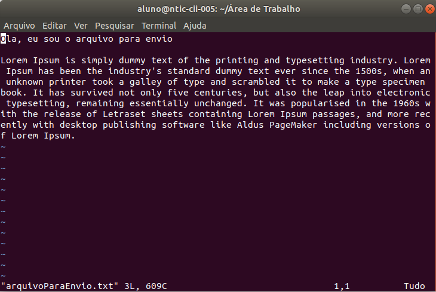

# Trabalho Pratico - Enviar arquivo de um PC para outro

O objetivo dessa trabalho consiste em basicamente enviar um arquivo de texto de um computador para outro. Para tal,
foi utilizado a linguagem ShellScript, devido a um sorteio feito em sala de aula.

Para isso, desenvolveu-se dois códigos, um que irá rodar na máquina onde o arquivo está, ou seja, na máquina que enviará o arquivo
e outro que irá rodar na máquina que receberá o arquivo, chamados carinhosamente de enviador e recebedor, respectivamente.

A base do funcionamento do trabalho executado é o *NetCat*, que trata-se de uma ferramenta de rede disponível para
os principais sistemas operacionais, porém, como utilizamos linux, o que irá nos interessar é o *NetCat* para linux.
